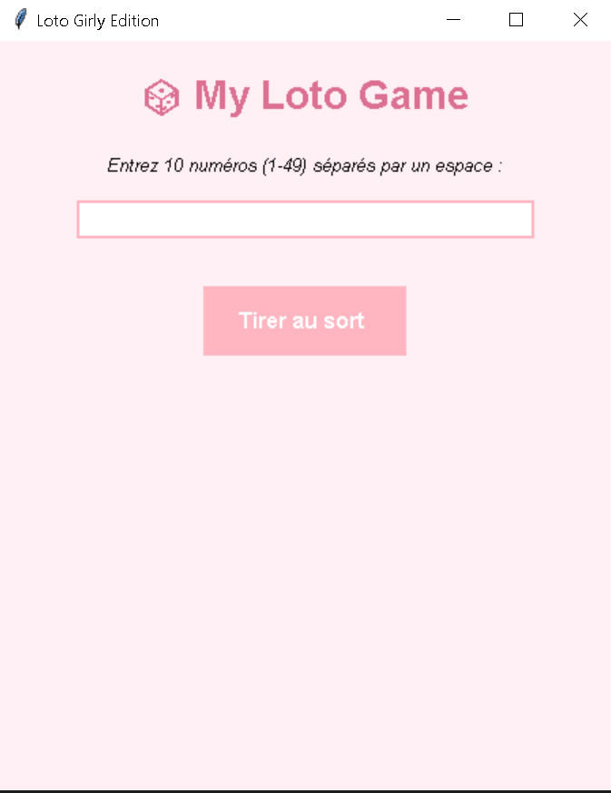
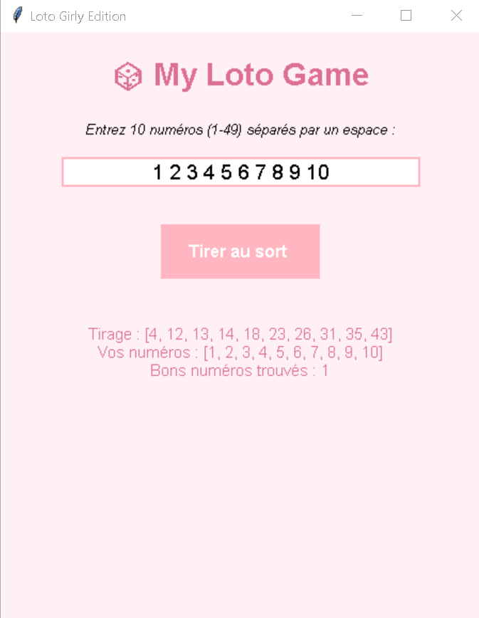
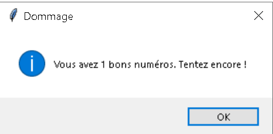
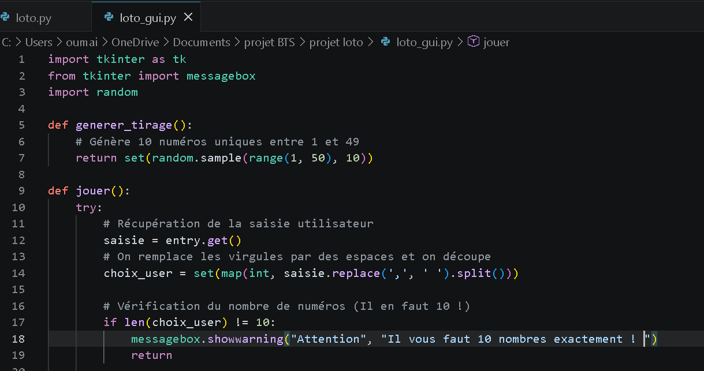
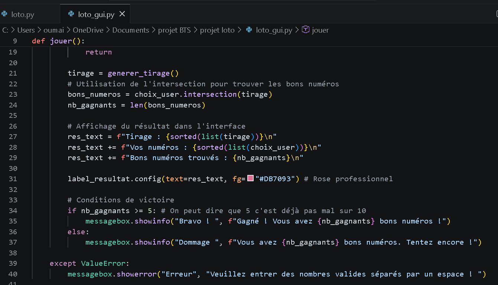
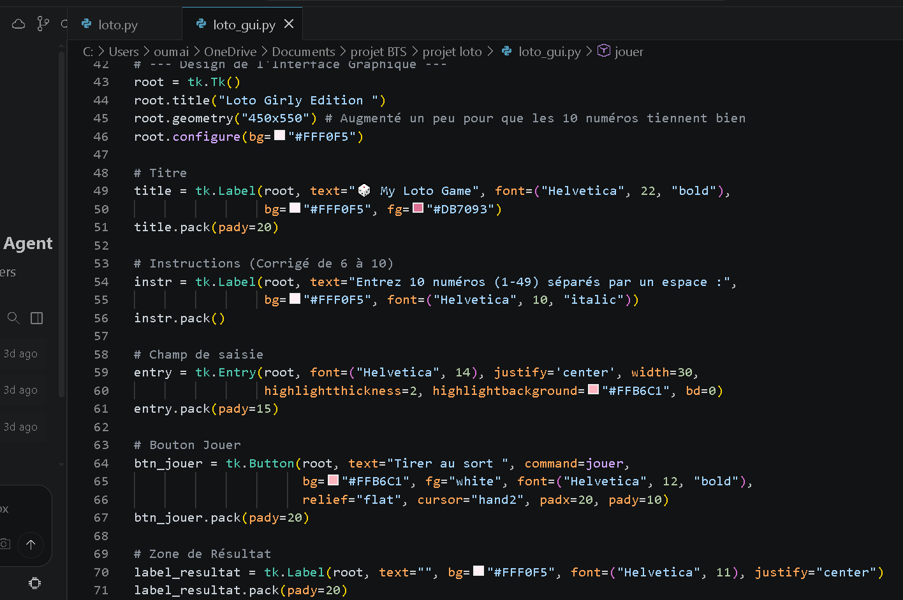

# 🎲 Application de Jeu du Loto - Python & Tkinter 

Bienvenue dans mon projet de **Jeu du Loto**. C'est une application interactive développée en Python, alliant une logique algorithmique précise et une interface utilisateur élégante et moderne.

##  Présentation du Projet
Ce projet simule un tirage de loto classique. L'utilisateur interagit avec une fenêtre graphique pour saisir ses numéros et découvrir ses gains en temps réel. L'objectif était de créer un outil fonctionnel avec un design soigné.

##  Interface Graphique (GUI)
L'interface a été conçue pour être à la fois professionnelle et esthétique ("Girly & Modern Style") :
- **Framework** : Utilisation de `Tkinter` pour une fenêtre fluide.
- **Design** : Palette de couleurs basée sur le rose pastel (`#FFB6C1`), le blanc et des touches de gris anthracite pour le texte.
- **Expérience Utilisateur** : Utilisation de boîtes de dialogue (`messagebox`) pour un feedback interactif.

##  Aperçus de l'Application
> **Note :** Voici des captures d'écran illustrant le fonctionnement de l'application.


*L'interface principale au lancement.*


*Affichage des résultats du tirage.*


*Affichage des résultats après un tirage.*

##  Explication du Code
Le code est structuré de manière modulaire pour garantir une meilleure maintenance :

1. **Génération du Tirage** : 
   - Utilisation de `random.sample` pour garantir 6 numéros uniques entre 1 et 49.
   - Stockage dans un `set` (ensemble) pour faciliter les comparaisons.


2. **Logique de Vérification (`jouer`)** :
   - Récupération de l'entrée utilisateur via `entry.get()`.
   - Traitement des erreurs (`try...except`) pour éviter les plantages si l'utilisateur saisit autre chose que des chiffres.
   - Utilisation de l'intersection d'ensembles (`choix_utilisateur.intersection(tirage)`) pour trouver instantanément les bons numéros.


3. **Interface Utilisateur** :
   - Configuration des widgets (`Label`, `Entry`, `Button`).
   - Gestion des couleurs et des polices pour un rendu personnalisé.


##  Focus Technique : L'Interface Graphique (GUI)

L'interface a été entièrement conçue avec la bibliothèque **Tkinter**. Voici l'extrait du code responsable de la structure et du design :

```python
# --- Configuration du Design & des Widgets ---

# Fenêtre principale avec couleur de fond personnalisée
root = tk.Tk()
root.title("Loto Girly Edition ")
root.geometry("450x500")
root.configure(bg="#FFF0F5") 

# Label du titre avec police Helvetica Bold
titre = tk.Label(root, text="🎲 Jeu du Loto", font=("Helvetica", 22, "bold"), 
                 bg="#FFF0F5", fg="#DB7093")
titre.pack(pady=25)

# Champ de saisie (Entry) avec mise en évidence des bordures
entry = tk.Entry(root, font=("Helvetica", 14), justify='center', width=20, 
                 highlightthickness=2, highlightbackground="#FFB6C1", bd=0)
entry.pack(pady=15)

# Bouton d'action stylisé sans relief (Flat Design)
btn_jouer = tk.Button(root, text="Tirer au sort ", command=jouer, 
                      bg="#FFB6C1", fg="white", font=("Helvetica", 12, "bold"),
                      relief="flat", cursor="hand2", padx=20, pady=10)
btn_jouer.pack(pady=20)


```
##  Technologies
- **Python 3.10+**
- **Bibliothèques** : `tkinter`, `random`
- **IDE** : Visual Studio Code (VS Code)

---
*Projet réalisé avec soin par **Oumaima Saoui , Paule Maeva , Sokhna Maimouna** (Étudiante en BTS SIO).*
